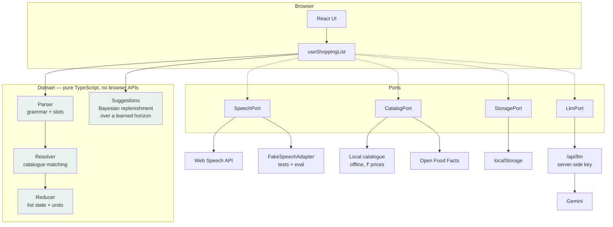
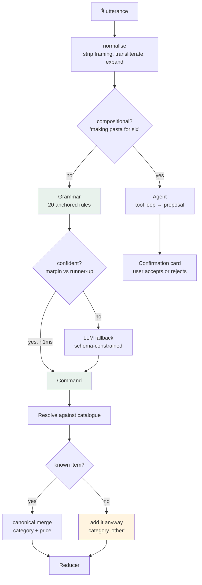

# Voice Shopping List

Add to your shopping list by speaking, in English or Hindi. Works offline, works
without a microphone, and works when the AI is unavailable.

**Live:** https://unthinkable-alpha.vercel.app

```bash
npm install
npm run dev          # http://localhost:5173
```

No account, no API key, no configuration required to run it.

**Add `?demo` to the URL** for a part-finished shop with purchase history, so the
categories, quantities and replenishment reasoning are all visible immediately.
A cold URL shows the honest empty state, which demonstrates none of that.

---

## What this is

A voice-driven shopping list that parses natural speech into structured commands —
`"add two litres of milk"`, `"take bread off the list"`, `"do litre doodh add karo"` —
categorises items, tracks quantities with real unit arithmetic, suggests what you
are likely running low on, and searches a real product catalogue with real prices.

The interesting part is not the feature list. It is that **every claim below is
measured**, and the numbers are reproducible with one command.

---

## The short version

Most voice list apps do this:

```js
if (transcript.includes('add')) { addItem(transcript.replace('add', '')) }
```

That fails on `"add 2 bottles of water"` (item becomes *"2 bottles of water"*),
on `"take milk off the list"` (a removal with no removal verb), and on
`"don't add milk"` (it adds the milk).

This one uses an anchored grammar with slot extraction, an item resolver grounded
in a 2,115-item catalogue derived from real retail data, and an LLM only for the
tail — measured, so we know exactly how much each layer is worth.

---

## Architecture

Recognition, storage, product search and the language model are all **ports**. The
domain is pure TypeScript with no browser imports, which is what makes any of it
testable.



### Why ports, specifically

Not architectural taste — a hard constraint. **The Web Speech API cannot run in a
test environment.** Chrome streams audio to Google's servers using API keys
compiled into the official binary; Chromium ships without them and throws
`error: 'network'`. Playwright drives bundled Chromium, and jsdom has no
implementation at all.

So recognition *had* to be injectable, or the application could not be tested.
Everything else follows from that one fact. This is the Humble Object pattern: the
adapter holds the untestable API surface and contains no logic.

A second constraint shapes the design. `SpeechGrammarList` and JSGF are inert —
the spec states grammar features "have no effect on speech recognition services".
There is no hotword biasing and no vocabulary injection, so **domain knowledge
cannot be pushed into the recogniser** and must be applied to the transcript
afterwards.

---

## How an utterance is handled



Three decisions in that diagram are worth calling out.

**Escalation uses the *margin*, not a threshold.** Two interpretations both scoring
well is genuine ambiguity, which an absolute cutoff waves straight through.
`"add milk to my shopping list"` never escalates — adding milk must never wait on a
network call or spend quota.

**Unknown items are added, not refused.** A catalogue is always smaller than what
people say. `"add chia seeds"` and `"add zorblex crunch bars"` both work; the second
lands under *Other* with lower confidence, flagged in the UI. Resolution *enriches*,
it does not *validate*. It refuses whole sentences, though — the fallback exists so
an unrecognised *product* still reaches the list, not so a clause can be stored as one.

**Compound utterances are parsed clause by clause.** People chain requests:
*"add two litres of milk and I also need apples and bananas"*. Each clause is parsed
as a complete utterance, and one carrying no verb — *"bananas"* — inherits the intent
before it. That also makes `"add milk and remove bread"` work, which splitting a
single rule's item span could not express. A destructive command is only honoured
when it is the entire utterance, so *"…and clear the list"* buried in a sentence is
ignored — a hot microphone picks up speech nobody addressed to it.

**The agent proposes, it never mutates.** Its three tools are read-only by
construction — there is no write tool for a model to reach for, which makes prompt
injection through a product name inert.

---

## Interface

Built for where it is actually used: standing in a shop, phone in one hand, eyes
mostly on the shelves. Three consequences run through the layout.

**The microphone is the largest control on screen.** Anything smaller says the
keyboard is the real interface and voice is a novelty bolted on.

**The list is scannable, not readable.** A colour rail per aisle means finding the
dairy line takes a glance rather than a parse — which is the actual task when you
are standing in front of a shelf.

**Typing is a first-class path, never a fallback.** Roughly a third of browsers
cannot do speech recognition at all, and a noisy shop defeats most of the rest.

Every foreground/background pair is checked against WCAG AA rather than eyeballed.
The obvious grocery green (`#059669`) is deliberately *not* the button colour:
white on it measures 3.77:1 and fails, so interactive surfaces use `#047857` at
5.48:1. Icons are inline SVG on a shared 24px grid — emoji render differently on
every platform, are announced by screen readers as whatever their unicode name
happens to be, and cannot inherit colour.

Motion is decorative throughout: colour, position and text carry the same
information, so `prefers-reduced-motion` stops all of it without anything becoming
unclear. Layout holds at 320px with no horizontal scroll.

---

## Measured results

Everything here is reproducible:

```bash
npm run eval          # ablation over MASSIVE
npm run eval:errors   # per-rule precision + error analysis
```

Evaluated on **MASSIVE** (Amazon Science, CC BY 4.0) — 16,521 real assistant
utterances per locale, professionally localised. None of it was written by me,
which is the point: a corpus you author yourself cannot tell you anything you had
not already assumed.

**Held-out test split, en-US** (142 in-domain, 2,832 out-of-domain):

| Configuration | fired | correct family | false positives | resolved | p95 |
|---|---|---|---|---|---|
| exact match only | 20.4% | 18.3% | 1.0% | 5 | 0.05ms |
| **+ fuzzy** | **21.1%** | **19.0%** | **1.1%** | **8** | 2.6ms |
| + phonetic | 20.4% | 18.3% | 1.0% | 5 | 0.04ms |

**hi-IN test split** — every Hindi command that fires is correct:

| Configuration | fired | correct family | false positives |
|---|---|---|---|
| exact match only | 23.9% | 23.9% | 2.1% |
| **+ fuzzy** | **23.9%** | **23.9%** | **2.1%** |

### What the numbers mean

**False positives are the metric to trust.** The 15,728 out-of-domain utterances
need no label mapping — they are alarms, music and weather, and a shopping list
must not act on any of them. Early versions fired on 5.1% of them, resolving
*"put on some coldplay"* to **eggs** and *"remove the alarm"* to **potato**. That is
now 1.0%, and a chunk of the remainder is benchmark artifact rather than bug:
*"I need coffee"* is labelled `iot_coffee`, but in a dedicated shopping app adding
coffee is correct.

**Recall is deliberately not optimised further.** Of the 793 `lists` utterances,
160 are list-level operations, 299 are read-back queries, and much of the rest is
not grocery at all — *"remove events from my list"*, *"delete the first item"*.
Chasing that number would be benchmark-gaming, not product work. MASSIVE is an
excellent false-positive benchmark and a weak recall benchmark for this specific
product, and it is reported that way.

### Phonetic matching was built, measured, and rejected

Double Metaphone is a standard technique for exactly this problem. It is
implemented here and **switched off by default**, because it buys +0.5pp recall
for +0.1pp false positives — and because MASSIVE is written text, so it contains
no acoustic errors at all. The benchmark can measure phonetic matching's *cost*
but structurally cannot measure its *benefit*. Shipping a component whose upside
is unmeasurable and whose downside is measured is a bad trade.

The code stays so the ablation row reproduces.

---

## The recommender predicts rather than reacts

Most shopping-list suggestions answer *"what are you out of?"*. That is the one
question whose answer is useless at the moment it is asked — you are standing in
the shop, and anything you have already run out of, you ran out of days ago.

This one answers **"what will you run out of before you are next here?"**

Both questions run through the same Gamma-Poisson posterior. The difference is
the horizon they are evaluated over, and it changes which items speak at all:

| item | cycle | last bought | P(out now) | reactive | P(out by next shop) | predictive |
|---|---|---|---|---|---|---|
| milk | 5d | 2 days ago | 33% | *silent* | **83%** | **suggests** |
| yoghurt | 6d | 6 days ago | 63% | suggests | 88% | suggests |
| rice | 42d | 30 days ago | 51% | suggests | 59% | suggests |
| ketchup | 107d | 100 days ago | 61% | suggests | 63% | suggests |

Milk is the case worth catching and the only one a reactive recommender misses.
Long-cycle items barely move under the same horizon, because a 42-day cycle
dwarfs a 7-day week — that falls out of the exponential, nothing special-cases it.

**The horizon is modelled, not assumed.** Shopping trips are a Poisson process
exactly as purchases are, so the same conjugate update runs one level up: a
population prior, pulled toward this shopper's own rhythm as they accumulate
trips. Someone who shops twice a week and someone who does a monthly stock-up get
different answers from the same code, and the interface states which basis it is
speaking from — *"You shop about every 5 days"* once it has evidence, *"Assuming
you shop about every 9 days, like most shoppers"* before that.

The panel groups by *why*, because the three groups are different claims:
**Probably out** (your history), **Before your next shop** (your history plus your
cadence), **Worth restocking** (population behaviour, when there is no history).
Each row draws its own evidence — elapsed time, the point the item is more likely
gone than not, and where the next trip falls.

### A units bug the extension exposed

Building the horizon meant re-reading the posterior, which had a real defect.
`fitGamma` fits β to the *gap* distribution, so β carries units of 1/day — but
`posteriorRate` used it as **pseudo-exposure in days**, where it was ≈0.03. The
prior added ~0.7 phantom purchases and essentially no phantom time, so every
cycle came out short. On held-out Instacart users it predicted too short **51.9%**
of the time.

`npm run tune:prior` replaces it with the dimensionally coherent form and sweeps
the prior strength over **47,828 real purchase sequences**, confirming once on a
disjoint **47,686**. Both slices are disjoint from the users the priors were
fitted on. Scored on mean |log(predicted / actual)| rather than absolute error,
because cycles here span a day to a year and the model is used to decide ratios.

| purchases in history | 3 | 4–5 | 6–9 | 10–19 | 20+ | overall |
|---|---|---|---|---|---|---|
| change vs. previous | **+13.4%** | +5.4% | +2.2% | −0.5% | −1.7% | **+3.9%** |

MAE 14.76d → 14.37d, and the short-bias falls from 51.9% to 46.2%.

### The pre-registered rule failed, and that is recorded

The rule used for the parser ablation — *improve one slice by ≥2 points without
degrading any other by more than 1* — **fails here at every prior strength
tested**, including the weakest. That is not a tuning problem. Trading a large
gain on thin evidence for a small loss on thick evidence is what shrinkage *is*,
so a rule forbidding any slice from losing forbids the technique outright.

It was written for parser slices, which are **languages**: improving English by
regressing Hindi fails a group of people permanently. These slices are
**stages every shopper passes through** — everyone starts at three purchases, some
arrive at twenty. Refusing all shrinkage to protect the deepest slice would make
the app measurably worse for every user during the period they are new, which is
the only period this app has ever been used in.

So the rule is reported as failed rather than quietly dropped, and replaced with a
stated stopping rule: *raise the prior while a step returns more overall than it
costs the deepest slice*. That lands on 1.5 — the knee, not the peak. The peak
(strength 3) is 0.2 points better overall and costs the deepest slice 0.8 more.

A test asserts the model **does not** fully converge, so anyone strengthening the
prior has to re-run the sweep rather than discover the regression in production.

### `add_to_cart_order` was investigated and dropped

Instacart records the sequence items enter a basket, which sounded like a store
route worth ordering the list by. It is not. Mean normalised basket position by
department spans only **0.453 (dairy) to 0.569 (personal care)** across 6M rows —
everything clusters at 0.5. In hindsight it is obvious: Instacart is *online*
ordering, so nobody walks a store and the sequence reflects how the app presents
categories. The differences are real at that n and far too small to act on.

---

## Every number has a source

There are no invented constants in this codebase. Each is either derived from a
public dataset or tuned against a held-out split.

| Value | Source |
|---|---|
| Catalogue: 2,115 items, categories, ₹ prices, discounts | BigBasket, 27,555 real SKUs → `npm run build:catalog` |
| Item frequency priors | log-normalised SKU count |
| Replenishment priors (produce 12.6d, dairy 13.7d, household 26.4d) | Instacart, 32.4M order-product rows → `npm run build:priors` |
| Prior strength (1.5 purchases) | swept on 47,828 held-out Instacart sequences, confirmed on 47,686 more → `npm run tune:prior` |
| Trip cadence prior (9 days) | median over 169,230 Instacart users of their own median gap between orders |
| Category complements (lift) | Instacart basket co-occurrence, min. support 200 |
| Intent rule confidences | **measured precision** on MASSIVE train, not hand-set |
| Fuzzy match threshold (0.90) | boundary between observed recoveries and mis-resolutions |
| Verb inventories | MASSIVE frequency (remove 95, delete 58, erase 11…) |
| Framing prefixes | MASSIVE frequency ("please" 962, "can you" 436) |

The fuzzy threshold is pinned at the boundary between fuzzy matches that recover a
near miss and ones that answer confidently with the wrong item:

```
REJECT   water → wafer 0.893  ·  rap → grape 0.867  ·  opinion → onion 0.854
ACCEPT   brede → bread 0.907  ·  panner → paneer 0.922  ·  tomatoe → tomato 0.971
```

A mis-resolution is worse than no resolution, because the open-vocabulary path
would otherwise have added exactly what was said. Both sides are pinned by tests.

`npm run tune:threshold` originally derived this from a sweep against a
pre-registered false-positive bound. It no longer discriminates, and the script
says so: once unknown items pass through, every high-precision rule fires whether
or not resolution succeeded, so fire rate stopped responding to the threshold.
What it actually governs is *which item* you get, and MASSIVE carries no
item-level labels to score that against.

### The one hand-authored file

`src/data/aliases.ts` maps romanised Hindi to catalogue items — `doodh` → milk,
`tamatar` → tomato. No public dataset provides this. MASSIVE `hi-IN` is Devanagari
with no item-level slot annotation, L3Cube-HingCorpus is unlabelled, and product
catalogues list *"Amul Taaza Toned Milk 500ml"* but never *"doodh"*.

It contains word equivalences and **zero numbers**, and says so at the top.

---

## Multilingual

Hindi is verb-final, so every English-anchored rule structurally cannot match it —
`सूची से अंडे हटाओ` is *[list] se [item] remove*. Before dedicated SOV rules existed,
hi-IN scored **0.0%** across every configuration. That gap was invisible until the
system met real Hindi data.

Transliteration handles the details that matter:

| Input | Becomes | Why it matters |
|---|---|---|
| `दूध` | `doodh` | Word-final schwa deletion — not `doodha` |
| `शॉपिंग` | `shoping` | Candra vowel `ॉ`, used for loanwords |
| `ख़रीददारी` | `khareedadaaree` | Nukta letters exist pre- and decomposed; NFD folds both |
| `doodh` / `dudh` | one entry | Long-vowel folding |

So `दूध`, `doodh`, `dudh` and `milk` all reach the same row instead of splitting a
Hinglish speaker's list into four.

---

## Testing

```bash
npm test              # 282 tests
npm run verify        # typecheck + lint + test + build
```

**93%+ statements** across the domain.

Property-based tests (fast-check) found three bugs that example tests structurally
could not:

- **The app rendered a quantity it could not parse.** `formatQuantity` produced
  `"1kg"`; `parseQuantity` could not read it back. Typing `"add 500g paneer"`
  silently dropped the quantity.
- **Undo lost the checked state.** *Check an item off → remove it → undo → it
  returns unchecked.* Undo replayed an *inverse command*, and `remove`'s inverse
  was an `add`, which creates a fresh row. Inverse commands cannot express an
  operation that changes several fields at once. Replaced with a snapshot.
- **Rare Devanagari marks survived transliteration**, reaching the matcher as
  codepoints no alias could contain.

The parser is proven **total** over ~2,000 generated adversarial inputs: never
throws, always returns a well-formed command, confidence always within [0,1],
always deterministic. Injection-shaped payloads (`{"kind":"clear"}`, `<script>`,
`DROP TABLE`) are inert, because commands are values produced by a grammar and are
never strings evaluated anywhere.

### The secret-leak guard

`tests/config.leak.test.ts` runs a real production build with canary values
planted in every plausible `VITE_*` variable and asserts none reach the bundle.

This guards a real regression. An earlier revision read the model key from
`import.meta.env.VITE_GEMINI_API_KEY`; Vite inlines those at build time, so the key
appeared verbatim in the shipped JavaScript. A code review would not reliably catch
a reintroduction — `import.meta.env.VITE_ANYTHING` looks like ordinary
configuration, and only the build output reveals the problem. So the build itself
is the assertion.

---

## Deployment

Static SPA plus one function. No database, no auth, no sessions.

```bash
vercel env add GEMINI_API_KEY production    # optional
npm run verify && vercel deploy --prod
```

`api/llm.ts` holds the key server-side. It is deliberately **not** a passthrough —
a naive proxy is an open, anonymous, free LLM for anyone who finds the URL. The
client selects an *operation*, never a prompt; system prompts, tool definitions and
token ceilings all live server-side, and requests are rate limited per IP.

**The app is fully functional with no key.** Voice, list, categories, quantities,
suggestions and search all work; only the LLM fallback and the agent route are
unavailable, and the UI says so rather than failing silently.

---

## Known limitations

Stated plainly, because pretending otherwise would be worse.

- **Seasonal suggestions are not implemented.** The brief asks for them and no open
  dataset maps produce to months; Instacart has day-of-week but no calendar date.
  Rather than hand-author a season table, the gap is left open. *"On sale"* is
  implemented, because BigBasket carries both marked and selling price so discount
  is measurable.
- **Substitutes are same-category nearest-by-frequency**, and **complement
  suggestions were removed entirely**. Instacart gives reliable *category*
  co-occurrence — dairy and meat, lift 1.17 across 45,824 baskets — but the leap to
  a specific product is not supported, and the output proved it: buying milk
  suggested pork, because pork had the highest SKU count in the meat category.
  Nothing in the data connects those items, only their categories. Product-level
  co-occurrence is the fix and this dataset is too sparse for it.
- **Hinglish is measured on a proxy.** No labelled code-mixed corpus exists for
  list intents. Devanagari Hindi is measured on MASSIVE's real held-out split;
  romanised Hinglish relies on deterministic transliteration.
- **The catalogue is Indian retail.** Regionally accurate, but a US or European
  shopper will hit the open-vocabulary path more often.
- **Rate limiting is per-instance and in-memory.** A speed bump against casual
  abuse, not a guarantee. A durable store is the real answer.
- **The 10ms Cloudflare / 60s Vercel function limits** were both verified against
  current documentation rather than assumed.

---

## Approach

> Speech recognition is the constraint that shapes everything. The Web Speech API
> cannot run in any test environment — Chromium lacks Google's API keys — so
> recognition had to become an injected port before a single feature could be
> verified. That one fact produced the whole architecture.
>
> I decided early that claims would be measured, not asserted. Rather than write my
> own test corpus, which can only confirm what I already assumed, I evaluated
> against MASSIVE: 16,521 real assistant utterances I did not author. Its 15,728
> out-of-domain utterances became a false-positive benchmark, and the first run was
> humbling — the parser resolved "put on some coldplay" to eggs.
>
> Every constant is derived. Item catalogue and prices from 27,555 BigBasket SKUs;
> replenishment priors fitted to 32.4M Instacart order rows; intent confidences are
> measured rule precision; the fuzzy threshold came from a sweep against a
> pre-registered constraint. Phonetic matching was implemented, measured, and
> switched off — the benchmark could measure its cost but not its benefit.
>
> Hindi needed verb-final rules; before them it scored 0.0%. Property-based testing
> found three bugs example tests could not, including undo silently losing an item's
> checked state.

_(197 words)_

---

## Data sources and licences

| Dataset | Licence | Used for |
|---|---|---|
| [MASSIVE](https://github.com/alexa/massive) (Amazon Science) | CC BY 4.0 | Evaluation, verb and framing frequencies |
| [BigBasket Products](https://www.kaggle.com/datasets/surajjha101/bigbasket-entire-product-list-28k-datapoints) | CC BY-NC-SA 4.0 | Catalogue, categories, ₹ prices, discounts |
| [Instacart 2017](https://www.instacart.com/datasets/grocery-shopping-2017) | CC0 mirror; original terms non-commercial | Replenishment priors, complement lift |
| [Open Food Facts](https://world.openfoodfacts.org/) | ODbL | Live product search |

**Non-commercial use only**, inherited from BigBasket and Instacart. Share-alike
propagates to the derived files in `src/data/*.generated.json`.

Raw datasets (1.4 GB) are not committed. Regenerate with:

```bash
kaggle datasets download -d surajjha101/bigbasket-entire-product-list-28k-datapoints --unzip -p data-raw/bigbasket
kaggle datasets download -d psparks/instacart-market-basket-analysis --unzip -p data-raw/instacart
curl -sSL -o data-raw/massive.tar.gz https://amazon-massive-nlu-dataset.s3.amazonaws.com/amazon-massive-dataset-1.1.tar.gz

npm run build:catalog && npm run build:priors
```

---

## Project layout

```
src/
  domain/          pure TypeScript — no browser or React imports
    parser/        normalisation, intent grammar, LLM fallback
    resolve/       phonetic index, distance metrics, linear scorer
    list/          reducer, undo, unit ontology
    recommend/     Bayesian replenishment, trip-cadence horizon, staples
    agent/         compositional planning, read-only tools
  ports/           SpeechPort · CatalogPort · LlmPort · StoragePort
  adapters/        Web Speech, Fake, Open Food Facts, localStorage, proxy
  data/            generated artifacts + the one hand-authored alias file
  ui/              React
api/llm.ts         server-side model proxy
scripts/           eval harness, ablation, dataset derivation, threshold + prior sweeps
```

Dependencies are deliberately minimal: React, Zod, `double-metaphone`. Styling is
plain CSS with custom properties — no utility framework.
